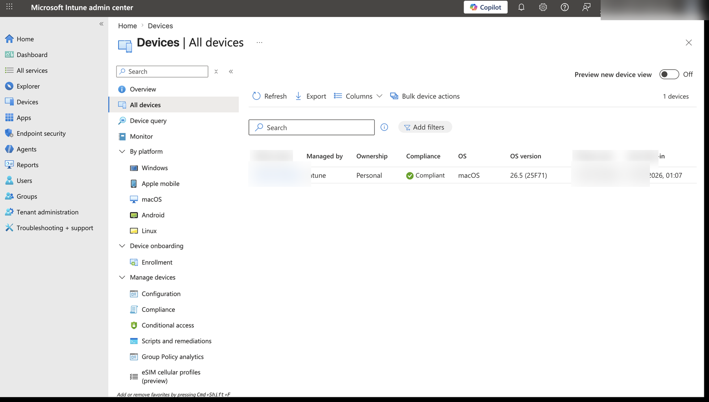
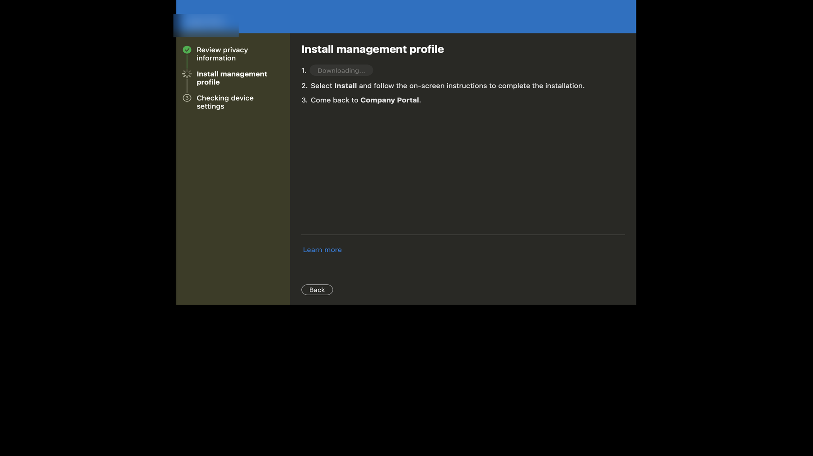
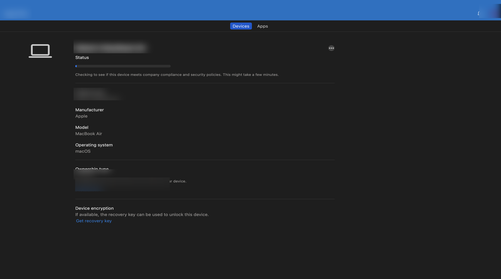

# Phase 3 - Endpoint Enrollment & Intune Operations

## Executive Summary

Phase 3 documents a macOS enrollment and device-governance workflow using Microsoft Intune and Company Portal. The retained evidence shows management-profile installation, managed-device inventory, compliance state, ownership, operating-system details, and device status review.

Earlier repository wording described Defender for Endpoint incident and recommendation evidence that the screenshots did not prove. Those claims and misleading filenames were removed. This phase now states only what the retained evidence supports.

## Business Problem

Endpoint administrators need a repeatable way to enroll personal or corporate devices, confirm that management is active, review device ownership and platform details, and understand whether a device satisfies assigned compliance controls.

## Implemented Workflow

1. Initiated macOS enrollment through Company Portal.
2. Downloaded the management profile and followed the local installation workflow.
3. Reviewed the device in the Intune managed-device inventory.
4. Confirmed the recorded platform, ownership, management authority, and compliance state.
5. Reviewed Company Portal device status and available recovery-related controls.

## Evidence Status

| Area | Status | Limitation |
|---|---|---|
| Company Portal enrollment | Demonstrated | Screenshot shows the management-profile installation stage, not a zero-touch deployment |
| Intune managed-device visibility | Demonstrated | One lab macOS device is shown; this is not evidence of fleet-scale administration |
| Compliance state | Demonstrated | Intune displayed the device as compliant at capture time; the screenshot does not prove every underlying setting independently |
| Defender for Endpoint | Not retained as Phase 3 evidence | No incident, recommendation, exposure, or endpoint-risk screenshot in the prior set was technically credible enough to keep |

## Evidence Gallery

**Managed-device inventory:** Shows an Intune-managed personal macOS device with management authority, compliance state, OS version, and last check-in. Device and account identifiers were sanitized.

**Enrollment workflow:** Shows the Company Portal management-profile installation step used to enroll macOS into Intune management.

**Device status review:** Shows Company Portal evaluating compliance and displaying ownership, platform, and encryption-related device information. Personal and tenant labels were sanitized.

## Skills Demonstrated

- Microsoft Intune device administration
- macOS Company Portal enrollment
- Managed-device inventory review
- Compliance and ownership interpretation
- Evidence sanitization and documentation
- Clear separation between demonstrated configuration and unsupported security claims

## Lab Scope

This is a self-directed implementation exercise in an isolated Microsoft 365 demonstration environment. It does not represent production fleet ownership, Defender incident response, automated remediation, or measured enterprise outcomes.
