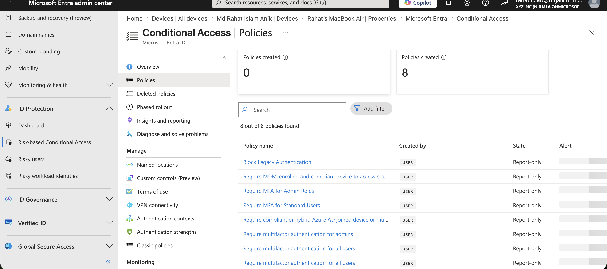
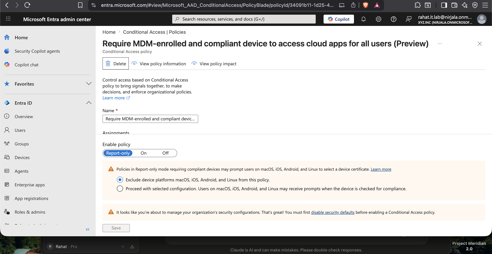
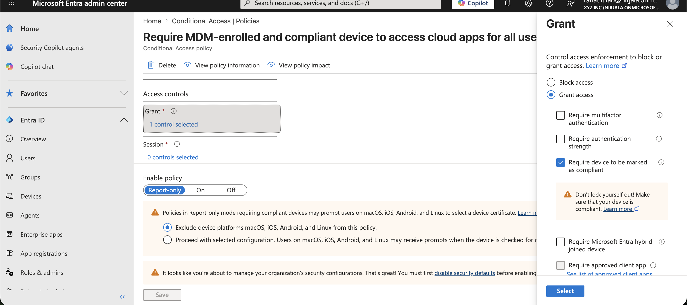
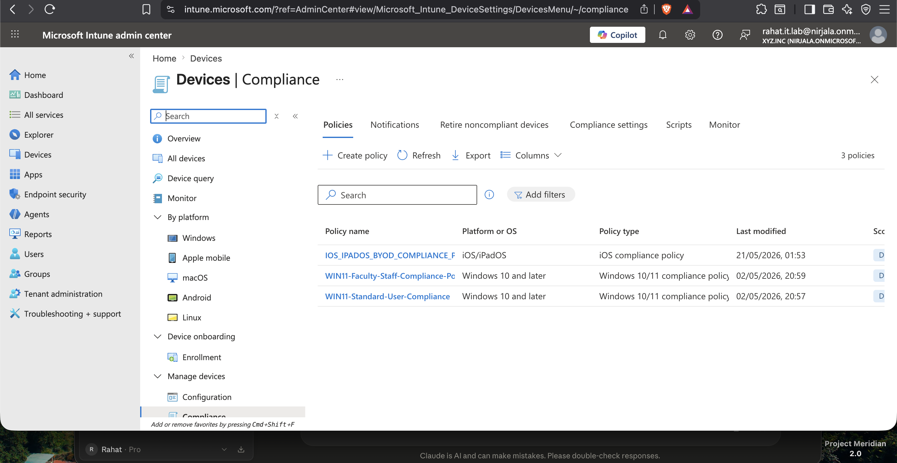
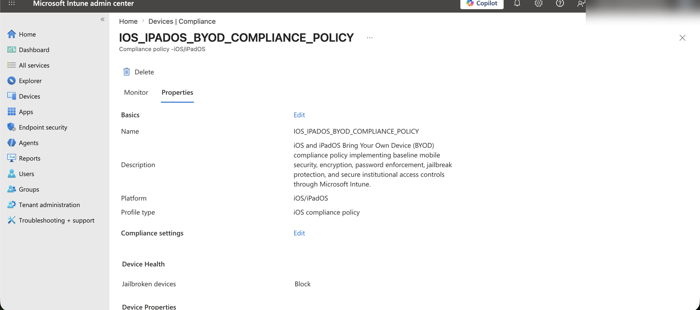
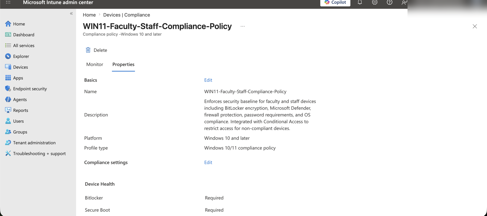

# Phase 4 — BYOD Conditional Access Governance

> **Enterprise-IT-Security-Operations-Toolkit**
> Simulated enterprise environment using an isolated Microsoft 365 lab tenant.

---

## 📋 Project Overview

This phase implements a **Zero Trust BYOD governance model** using Microsoft Entra ID, Microsoft Intune, and Conditional Access. The objective is to configure and validate a clear security boundary between corporate-managed devices and personal/BYOD devices accessing organizational resources.

### Business Problem

In modern enterprise environments, employees increasingly use personal devices (smartphones, laptops, tablets) to access corporate resources such as email, SharePoint, and Teams. Without proper governance, these unmanaged devices introduce significant security risk:

- No visibility into device health or compliance state
- No control over data leaving the organization
- No enforcement of encryption, antivirus, or OS standards
- Inability to remotely wipe corporate data if a device is lost or stolen

### Solution

This project implements a tiered device compliance and access control framework:

| Device Type | Trust Level | Access |
|---|---|---|
| Corporate device (Entra Joined, Intune-managed, Compliant) | High | Full access to all cloud apps |
| BYOD/Personal device (Entra Registered, Compliant) | Medium | Restricted access based on CA policy |
| Unmanaged/Non-compliant device | Low | Blocked by Conditional Access |

---

## 🛠️ Technologies Used

| Tool | Purpose |
|---|---|
| Microsoft Entra ID | Device registration, identity, Conditional Access |
| Microsoft Intune | Device compliance policies, MDM enrollment |
| Conditional Access | Configure compliant-device requirements for cloud app access |
| PowerShell + Microsoft Graph | Automated device inventory and compliance reporting |
| Microsoft Graph API | Query devices, compliance policies, CA policies |

---

## 🏗️ Architecture

```
┌─────────────────────────────────────────────────────────────┐
│                    Microsoft Entra ID                        │
│                                                             │
│  ┌──────────────┐    ┌──────────────┐    ┌──────────────┐  │
│  │  Corporate   │    │    BYOD/     │    │  Unmanaged   │  │
│  │   Device     │    │  Personal    │    │   Device     │  │
│  │ (Entra Join) │    │  (Registered)│    │  (Unknown)   │  │
│  └──────┬───────┘    └──────┬───────┘    └──────┬───────┘  │
│         │                   │                   │           │
│         ▼                   ▼                   ▼           │
│  ┌─────────────────────────────────────────────────────┐   │
│  │           Conditional Access Engine                  │   │
│  │    "Require device to be marked as compliant"        │   │
│  └──────────┬──────────────────────────────────────┬───┘   │
│             │                                      │        │
│             ▼                                      ▼        │
│      ✅ GRANT ACCESS                        ❌ BLOCK ACCESS  │
│    (Compliant Device)                    (Non-Compliant)    │
└─────────────────────────────────────────────────────────────┘
                         │
                         ▼
              ┌──────────────────┐
              │  Microsoft Intune │
              │  Compliance Rules │
              │  - BitLocker      │
              │  - Antivirus      │
              │  - Firewall       │
              │  - Password       │
              │  - Jailbreak      │
              └──────────────────┘
```

---

## 📁 Repository Structure

```
phase-4-byod-conditional-access-governance/
├── scripts/
│   ├── byod-device-inventory.ps1          # Entra ID device inventory by ownership & compliance
│   ├── byod-access-policy-audit.ps1       # Conditional Access policy audit for BYOD
│   └── compliant-device-access-audit.ps1  # Cross-reference devices with CA compliance policies
├── reports/                               # CSV outputs from script execution
├── screenshots/                           # Admin center evidence
└── README.md
```

---

## 🔧 PowerShell Scripts

### Script 1 — `byod-device-inventory.ps1`
Connects to Microsoft Graph and pulls all registered/joined devices from Entra ID. Classifies each device by:
- **Ownership** (Corporate vs BYOD/Personal vs Unknown)
- **Trust type** (Entra Joined / Entra Registered / Hybrid Joined)
- **Compliance state** (Compliant / Non-Compliant / Unknown)
- **Managed state** (MDM Managed vs Unmanaged)
- **Last sign-in date**

Exports full inventory to CSV for governance reporting.

**Required Graph Scopes:** `Device.Read.All`, `DeviceManagementManagedDevices.Read.All`

---

### Script 2 — `byod-access-policy-audit.ps1`
Audits all Conditional Access policies and identifies:
- Policies requiring device compliance as a grant control
- Policies targeting BYOD/personal devices via device filters
- Policies blocking unmanaged devices
- Report-only vs enabled policy states

Exports audit results to CSV.

**Required Graph Scopes:** `Policy.Read.All`

---

### Script 3 — `compliant-device-access-audit.ps1`
Cross-references the device inventory with compliance-dependent CA policies to determine:
- Which devices have full access (compliant)
- Which devices are restricted or blocked (non-compliant)
- How many CA policies are impacting non-compliant devices
- CA impact summary per device

Exports full audit to CSV.

**Required Graph Scopes:** `Device.Read.All`, `DeviceManagementManagedDevices.Read.All`, `Policy.Read.All`

---

## 📸 Implementation Screenshots

### 1. Project Setup — Terminal
Phase 4 folder structure and PowerShell script files created via terminal.


---

### 2. Entra ID — All Devices
Microsoft Entra admin center showing the registered device inventory. Rahat's MacBook Air is visible as a registered BYOD device (Microsoft Entra registered, MacMDM, owned by Md Rahat Islam Anik).


---

### 3. Entra ID — Device Properties (Top)
Device detail page showing device name, Device ID, Object ID, OS (MacMDM), version, join type (Microsoft Entra registered), and owner.


---

### 4. Entra ID — Device Compliance State
Scrolled view of the same device showing compliance state = **No** — this BYOD device is non-compliant and would be blocked by the Conditional Access policy requiring compliant devices.


---

### 5. Conditional Access — Policy List
8 Conditional Access policies configured in the tenant. All are in **Report-only** mode for safe lab testing. Key policies visible include:
- Block Legacy Authentication
- Require MDM-enrolled and compliant device to access cloud apps
- Require MFA for Admin Roles
- Require compliant or hybrid Azure AD joined device



---

### 6. Conditional Access — Require Compliant Device Policy
The core BYOD governance policy: **"Require MDM-enrolled and compliant device to access cloud apps for all users"**. Set to Report-only mode. Targets all users and all cloud apps.



---

### 7. Conditional Access — Grant Control
Grant control panel showing **"Require device to be marked as compliant"** is selected. In an enabled rollout, this control would deny access for non-compliant or unmanaged BYOD devices; in this lab it is documented as part of report-only validation.



---

### 8. Intune — Compliance Policies List
Three device compliance policies configured in Microsoft Intune:
- `IOS_IPADOS_BYOD_COMPLIANCE_POLICY` — for personal iOS/iPadOS devices
- `WIN11-Faculty-Staff-Compliance-Policy` — strict policy for staff Windows devices
- `WIN11-Standard-User-Compliance` — baseline policy for standard Windows users



---

### 9. Intune — iOS BYOD Compliance Policy
BYOD-specific compliance policy for iOS/iPadOS devices configuring:
- Jailbreak detection (Block)
- Minimum OS version: 14.0
- Password required, minimum 8 characters, alphanumeric
- Password expiry: 90 days
- Previous password reuse prevention: 3



---

### 10. Intune — iOS BYOD Policy Assignments
iOS BYOD compliance policy assigned to **All Users**. Non-compliant devices are marked immediately. Demonstrates broad BYOD coverage across the organization.


---

### 11. Intune — WIN11 Faculty/Staff Compliance Policy
Strict compliance policy for corporate Windows 11 devices used by faculty and staff. Enforces:
- BitLocker encryption (Required)
- Secure Boot (Required)
- Code Integrity (Required)
- Microsoft Defender Antimalware + Real-time protection
- Firewall + TPM required
- Password: minimum 10 characters, alphanumeric



---

### 12. Intune — WIN11 Faculty/Staff Policy Assignments
Faculty/Staff Windows compliance policy assigned to All Users with a 1-day grace period before marking non-compliant, and a 3-day retire list action for persistent non-compliance.


---

### 13. Intune — Device Actions
Intune device actions panel showing a **Retire** action pending for Rahat's MacBook Air — demonstrating the ability to remotely retire unmanaged or non-compliant BYOD devices from organizational access.


---

## 🎯 Key Outcomes

- ✅ Device inventory classified by ownership, trust type, and compliance state
- ✅ Conditional Access policy configured to require compliant devices for cloud app access
- ✅ Three tiered compliance policies covering iOS BYOD, Windows standard, and Windows faculty/staff
- ✅ Non-compliant BYOD device (MacBook Air) identified and retirement action initiated
- ✅ PowerShell automation scripts for ongoing governance and reporting via Microsoft Graph

---

## 💼 Real-World Relevance

This implementation mirrors what enterprise IT teams face in organizations like hospitals, universities, and financial institutions — environments where employees use personal devices but must meet compliance standards before accessing sensitive data.

The Zero Trust principle applied here: **never trust, always verify** — every device, regardless of ownership, must prove compliance before accessing organizational resources.

---

## 🔗 Related Phases

| Phase | Topic |
|---|---|
| [Phase 1](../phase-1-enterprise-operations-foundation/) | Identity & Tenant Security Baseline |
| [Phase 2](../phase-2-identity-threat-security-operations/) | Identity Threat & Security Operations |
| [Phase 3](../phase-3-endpoint-security-defender-operations/) | Endpoint Security & Defender Operations |
| **Phase 4** | **BYOD Conditional Access Governance** ← You are here |

---

*Built by Md Rahat Islam Anik — Microsoft 365 Security Operations Portfolio*
*[LinkedIn](https://linkedin.com/in/rahatislamanik) • [GitHub](https://github.com/rahatislamanik-spec)*
