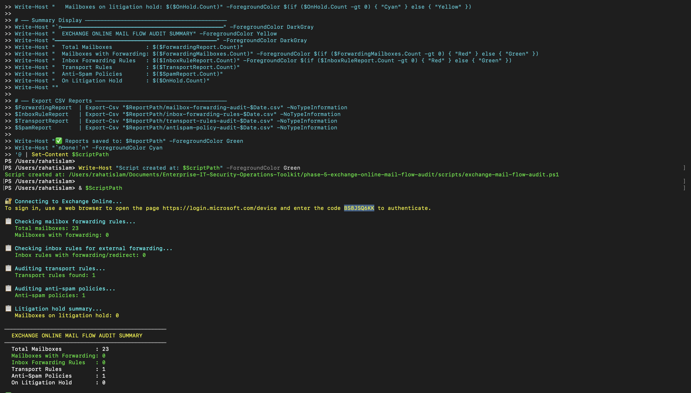
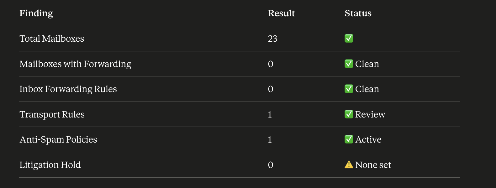
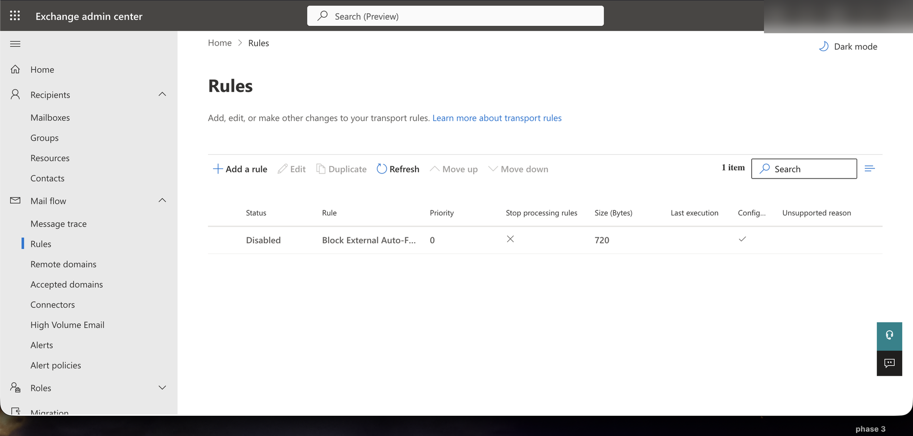
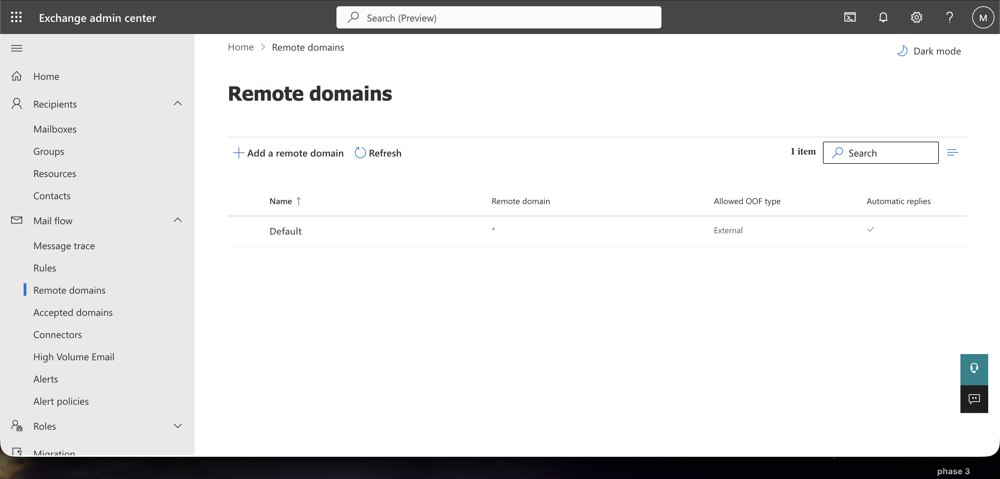
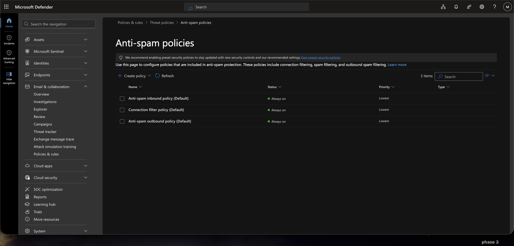

# Phase 5 — Exchange Online Mail Flow Audit

> **Enterprise-IT-Security-Operations-Toolkit**
> Simulated enterprise environment using Microsoft 365 Developer Tenant (xyz.inc / nirjala.onmicrosoft.com)

---

## 📋 Project Overview

This phase implements an automated **Exchange Online mail flow security audit** using PowerShell and the Exchange Online Management module. The objective is to identify data exfiltration risks, unauthorized forwarding rules, and mail flow policy gaps across the organization's Exchange Online environment.

### Business Problem

External email forwarding is one of the most common and dangerous data exfiltration vectors in Microsoft 365 environments. Without automated auditing, IT teams have no visibility into:

- Mailboxes silently forwarding emails to external addresses
- User-created inbox rules redirecting sensitive communications
- Transport rules that may be exposing organizational data
- Anti-spam policy gaps leaving the organization vulnerable
- Mailboxes lacking litigation hold for compliance requirements

### Solution

A single PowerShell script that connects to Exchange Online via Microsoft Graph and produces four structured CSV audit reports — covering the full mail flow security surface in under 3 minutes.

---

## 🛠️ Technologies Used

| Tool | Purpose |
|---|---|
| Exchange Online Management Module | PowerShell connection to Exchange Online |
| Microsoft 365 Exchange Admin Center | Mail flow rules, remote domains, mailbox management |
| Microsoft Defender for Office 365 | Anti-spam policy management |
| PowerShell 7+ | Script execution and report generation |
| Microsoft Graph | Authentication and API access |

---

## 🔧 Script

### `exchange-mail-flow-audit.ps1`

Connects to Exchange Online and performs 5 sequential audits:

**1. Mailbox Forwarding Audit**
Scans all 23 mailboxes for forwarding addresses configured at the mailbox level — both SMTP forwarding and internal forwarding. Flags any mailbox with `ForwardingSmtpAddress` or `ForwardingAddress` set.

**2. Inbox Rule Forwarding Audit**
Iterates through every mailbox and pulls inbox rules containing `ForwardTo`, `ForwardAsAttachmentTo`, or `RedirectTo` actions — the most common user-level data exfiltration vector.

**3. Transport Rule Audit**
Pulls all organization-level transport rules, documenting name, state, priority, and configured actions and conditions.

**4. Anti-Spam Policy Audit**
Documents all hosted content filter policies including spam action thresholds, high-confidence spam handling, phishing actions, and quarantine retention periods.

**5. Litigation Hold Summary**
Cross-references mailbox litigation hold status — identifying mailboxes not protected for compliance and eDiscovery purposes.

**Required PowerShell Scopes:** Exchange Online Management Module (`Connect-ExchangeOnline`)

---

## 📊 Lab Audit Results

From the Microsoft 365 Developer Tenant (nirjala.onmicrosoft.com):

| Finding | Result | Status |
|---|---|---|
| Total Mailboxes Audited | 23 | ✅ |
| Mailboxes with Forwarding | 0 | ✅ Clean |
| Inbox Forwarding Rules | 0 | ✅ Clean |
| Transport Rules | 1 | ⚠️ Review |
| Anti-Spam Policies | 1 Active | ✅ |
| Litigation Hold | 0 | ⚠️ Not configured |

**Key finding:** No unauthorized external forwarding detected across all 23 mailboxes. One transport rule (`Block External Auto-Forward`) is configured but currently disabled — a recommended security control that should be enabled in production environments.

---

## 📁 Repository Structure

```
phase-5-exchange-online-mail-flow-audit/
├── scripts/
│   └── exchange-mail-flow-audit.ps1    # Main audit script
├── reports/
│   ├── mailbox-forwarding-audit-2026-05-30.csv
│   ├── inbox-forwarding-rules-2026-05-30.csv
│   ├── transport-rules-audit-2026-05-30.csv
│   └── antispam-policy-audit-2026-05-30.csv
├── screenshots/
│   ├── 01-script-creation-terminal.png
│   ├── 02-script-execution-audit-summary.png
│   ├── 03-audit-findings-table.png
│   ├── 04-exchange-transport-rules.png
│   ├── 05-exchange-remote-domains.png
│   ├── 06-antispam-policies-defender.png
│   └── 07-exchange-mailboxes-list.png
└── README.md
```

---

## 📸 Implementation Screenshots

### 1. Script Creation
PowerShell script created and saved to the Phase 5 scripts directory via terminal.


---

### 2. Script Execution & Audit Summary
Full script execution showing live connection to Exchange Online via device authentication, all 5 audit sections running, and the final summary output.



---

### 3. Audit Findings Table
Structured findings summary showing all 6 audit categories with results and status indicators.



---

### 4. Exchange Admin Center — Transport Rules
Exchange Admin Center showing the `Block External Auto-Forward` transport rule — configured but currently disabled. Enabling this rule prevents users from auto-forwarding emails to external addresses.



---

### 5. Exchange Admin Center — Remote Domains
Remote domains configuration showing the default domain policy with external OOF (Out of Office) replies enabled and automatic replies permitted.



---

### 6. Microsoft Defender — Anti-Spam Policies
Microsoft Defender for Office 365 showing 3 active anti-spam policies — inbound, connection filter, and outbound — all set to Always on status.



---

### 7. Exchange Admin Center — Mailboxes
Exchange Online mailbox list showing all 22 user and shared mailboxes audited, with email addresses, recipient types, and archive status.


---

## 🎯 Key Outcomes

- ✅ 23 mailboxes audited for unauthorized forwarding — none detected
- ✅ All inbox rules scanned for forwarding/redirect actions — none detected
- ✅ Transport rule inventory documented with state and action details
- ✅ Anti-spam policy coverage verified across inbound, outbound, and connection filtering
- ⚠️ Litigation hold not configured — recommended for compliance-sensitive environments
- ⚠️ Block External Auto-Forward rule exists but is disabled — should be enabled in production

---

## 💼 Real-World Relevance

External email forwarding is consistently ranked as one of the top data loss vectors in Microsoft 365 environments. This audit directly addresses:

- **Insider threat detection** — identifying users forwarding corporate email externally
- **Compromised account detection** — attackers often set forwarding rules after account takeover
- **Compliance requirements** — litigation hold status is critical for legal and regulatory obligations
- **Security baseline verification** — confirming anti-spam policies are active and properly configured

This type of audit is standard practice in organizations subject to HIPAA, SOC 2, ISO 27001, and other compliance frameworks.

---

## 🔗 Related Phases

| Phase | Topic |
|---|---|
| [Phase 1](../phase-1-enterprise-operations-foundation/) | Identity & Tenant Security Baseline |
| [Phase 2](../phase-2-identity-threat-security-operations/) | Identity Threat & Security Operations |
| [Phase 3](../phase-3-endpoint-security-defender-operations/) | Endpoint Security & Defender Operations |
| [Phase 4](../phase-4-byod-conditional-access-governance/) | BYOD Conditional Access Governance |
| **Phase 5** | **Exchange Online Mail Flow Audit** ← You are here |

---

*Built by Md Rahat Islam Anik — Cloud Computing & Network Administration Graduate, George Brown Polytechnic*
*[LinkedIn](https://linkedin.com/in/rahatislamanik) • [GitHub](https://github.com/rahatislamanik-spec)*
