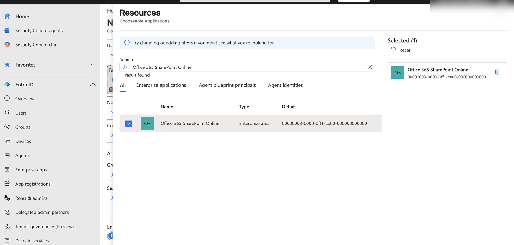
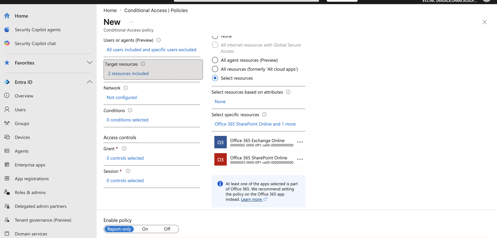
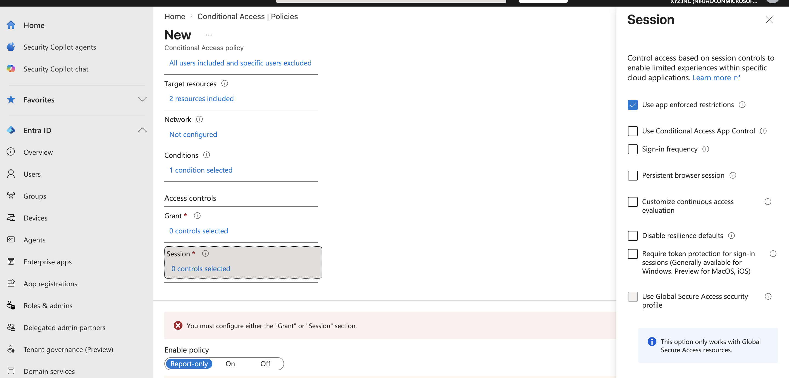
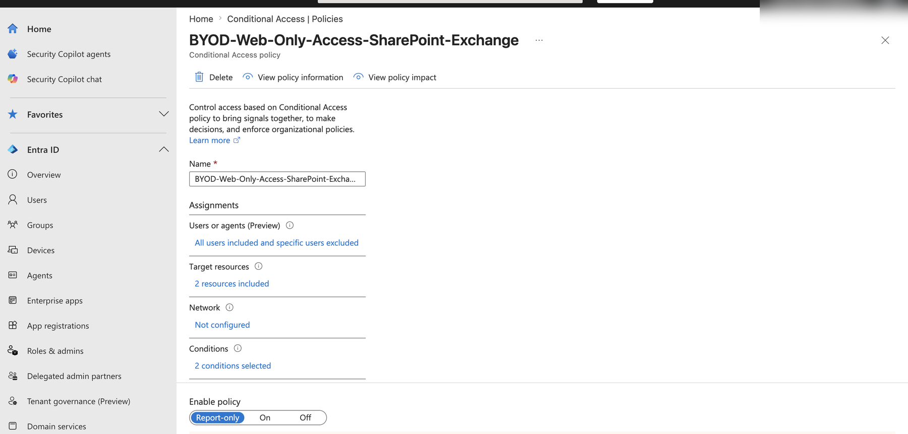
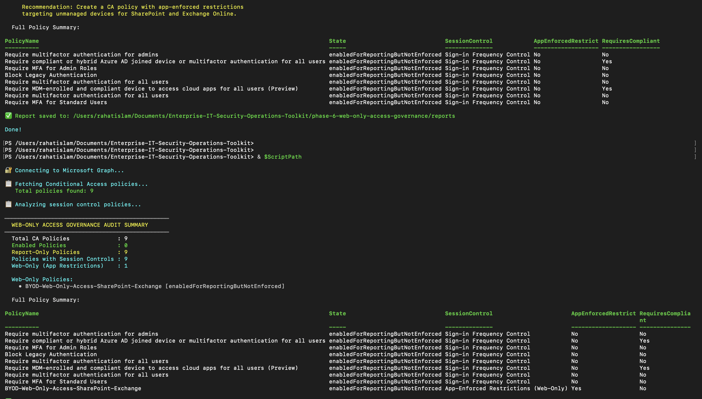

# Phase 6 — Web-Only Access Governance for Unmanaged Devices

> **Enterprise-IT-Security-Operations-Toolkit**
> Simulated enterprise environment using an isolated Microsoft 365 lab tenant.

---

## 📋 Project Overview

This phase implements a **web-only access governance model** using Conditional Access app-enforced restrictions. The objective is to configure and validate browser-only access for unmanaged and non-compliant personal devices before production-style enforcement.

### Business Problem

When employees use personal or unmanaged devices to access corporate resources, organizations face a critical challenge:

- Blocking access entirely reduces productivity and creates friction
- Allowing full access exposes corporate data to unmanaged endpoints
- Native apps (Outlook, Teams, OneDrive) sync and cache data locally on personal devices
- Files can be downloaded, forwarded, or printed without any control

### Solution — Web-Only Browser Access

A Conditional Access policy with **app-enforced restrictions** is configured to restrict non-compliant devices to browser-only access:

| Device Type | Access Type | Result |
|---|---|---|
| Compliant corporate device | Full native app access | Outlook, Teams, OneDrive apps work normally |
| Non-compliant / BYOD device | Web browser only | OWA, SharePoint web, Teams web — no downloads |
| Unmanaged device | Web browser only | Read-only web access, no native app sync |

---

## 🛠️ Technologies Used

| Tool | Purpose |
|---|---|
| Microsoft Entra ID | Conditional Access policy engine |
| Conditional Access — App-Enforced Restrictions | Session control for browser-only access |
| Exchange Online | Web-only OWA restriction |
| SharePoint Online | Web-only browser restriction |
| PowerShell + Microsoft Graph | Automated policy audit and reporting |

---

## 🏗️ Architecture

```
User attempts to access M365
            ↓
Conditional Access evaluates device
            ↓
    ┌───────────────────────────────┐
    │  Is device compliant?         │
    └───────────────────────────────┘
           ↙                ↘
         Yes                 No
          ↓                   ↓
   Full Access          Web-Only Access
   Native apps          Browser only
   Sync enabled         No downloads
   All features         Limited session
```

---

## 🔧 What Was Built

### Conditional Access Policy — `BYOD-Web-Only-Access-SharePoint-Exchange`

| Setting | Value |
|---|---|
| Users | All users |
| Target apps | Office 365 SharePoint Online + Office 365 Exchange Online |
| Device filter | `device.isCompliant -ne True` |
| Session control | Use app-enforced restrictions |
| State | Report-only |

**How it works:** When a non-compliant or unmanaged device accesses SharePoint Online or Exchange Online, the session is restricted to browser-only mode. Users can view and work with content in the browser but cannot use native apps or download files.

---

## 🔧 PowerShell Audit Script — `web-only-access-policy-audit.ps1`

Connects to Microsoft Graph and audits all Conditional Access policies for:

- Session controls configured (app-enforced restrictions, cloud app security, sign-in frequency)
- Web-only policies specifically using app-enforced restrictions
- Policy state (enabled vs report-only vs disabled)
- Target applications and device filter rules

Exports full audit to CSV for governance reporting.

**Required Graph Scopes:** `Policy.Read.All`, `Device.Read.All`, `Application.Read.All`

---

## 📊 Audit Results — Before & After

### Before (8 policies — 0 web-only)
```
Total CA Policies              : 8
Enabled Policies               : 0
Report-Only Policies           : 8
Policies with Session Controls : 8
Web-Only (App Restrictions)    : 0

⚠️  No web-only app-enforced restriction policies found.
    Recommendation: Create a CA policy with app-enforced restrictions
    targeting unmanaged devices for SharePoint and Exchange Online.
```

### After (9 policies — 1 web-only) ✅
```
Total CA Policies              : 9
Enabled Policies               : 0
Report-Only Policies           : 9
Policies with Session Controls : 9
Web-Only (App Restrictions)    : 1

Web-Only Policies:
  • BYOD-Web-Only-Access-SharePoint-Exchange [enabledForReportingButNotEnforced]
```

The script correctly identified the new policy as **"App-Enforced Restrictions (Web-Only)"** — demonstrating automated detection of web-only governance controls across the tenant.

---

## 📁 Repository Structure

```
phase-6-web-only-access-governance/
├── scripts/
│   └── web-only-access-policy-audit.ps1
├── reports/
│   └── web-only-access-policy-audit-2026-05-30.csv
├── screenshots/
│   ├── 01-ca-sharepoint-resource-selection.png
│   ├── 02-ca-both-apps-selected.png
│   ├── 03-ca-session-app-enforced-restrictions.png
│   ├── 04-ca-byod-web-only-policy-detail.png
│   ├── 05-audit-before-after-terminal.png
│   ├── 06-audit-after-git-push.png
│   └── 07-audit-before-zero-web-only.png
└── README.md
```

---

## 📸 Implementation Screenshots

### 1. Target Resource — SharePoint Online Selected
Selecting Office 365 SharePoint Online as one of the two target applications for the web-only access policy.



---

### 2. Both Apps Selected — SharePoint + Exchange
Both Office 365 SharePoint Online and Office 365 Exchange Online selected as target resources so the web-only restriction covers both email and document collaboration.



---

### 3. Session Control — Use App Enforced Restrictions
Session control panel showing **"Use app enforced restrictions"** checked — the core session control that restricts non-compliant devices to browser-only access when the policy is enabled.



---

### 4. Saved Policy Detail — BYOD-Web-Only-Access-SharePoint-Exchange
The completed Conditional Access policy showing all users targeted, 2 resources included (SharePoint + Exchange), 2 conditions selected (device filter + session), and Report-only state.



---

### 5. Audit Script — Before & After Output
Terminal showing both audit runs — first showing 0 web-only policies before creation, then showing 1 web-only policy after the `BYOD-Web-Only-Access-SharePoint-Exchange` policy was created. Clear before/after evidence of policy implementation.



---

### 6. After Audit — Git Push
Full audit output showing the new policy detected as "App-Enforced Restrictions (Web-Only)" followed by successful git push to GitHub.


---

### 7. Before Audit — Zero Web-Only Policies
Initial audit run showing 0 web-only app-enforced restriction policies and the automated recommendation to create one — demonstrating the gap identification capability of the script.


---

## 🎯 Key Outcomes

- ✅ Conditional Access policy created targeting SharePoint Online and Exchange Online
- ✅ Device filter configured to target non-compliant devices (`device.isCompliant -ne True`)
- ✅ App-enforced restrictions session control configured for browser-only access
- ✅ Report-only mode for safe lab testing and impact analysis
- ✅ PowerShell audit script detects and classifies web-only governance policies
- ✅ Before/after audit evidence demonstrating 0 → 1 web-only policy detection

---

## 💼 Real-World Relevance

Web-only access governance is a standard control in organizations where:

- Employees use personal devices (BYOD) to access corporate email and files
- Contractors and vendors need limited access without full device management
- Regulated industries (healthcare, finance, education) need data control without blocking access
- IT teams want to reduce data exfiltration risk without impacting productivity

This approach follows Microsoft's recommended Zero Trust access model: grant the minimum necessary access based on device compliance, not just identity.

---

## 🔗 Related Phases

| Phase | Topic |
|---|---|
| [Phase 1](../phase-1-enterprise-operations-foundation/) | Identity & Tenant Security Baseline |
| [Phase 2](../phase-2-identity-threat-security-operations/) | Identity Threat & Security Operations |
| [Phase 3](../phase-3-endpoint-security-defender-operations/) | Endpoint Security & Defender Operations |
| [Phase 4](../phase-4-byod-conditional-access-governance/) | BYOD Conditional Access Governance |
| [Phase 5](../phase-5-exchange-online-mail-flow-audit/) | Exchange Online Mail Flow Audit |
| **Phase 6** | **Web-Only Access Governance** ← You are here |

---

*Built by Md Rahat Islam Anik — Microsoft 365 Security Operations Portfolio*
*[LinkedIn](https://linkedin.com/in/rahatislamanik) • [GitHub](https://github.com/rahatislamanik-spec)*
