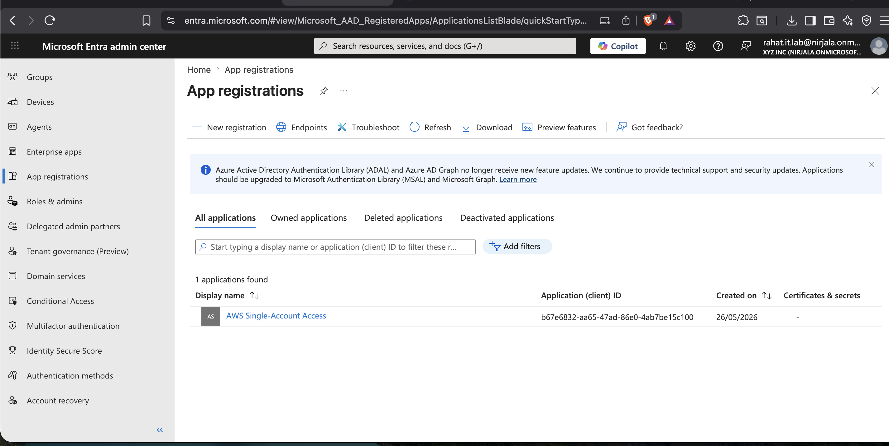

# Phase 7 — Entra ID App Registration Audit

> **Enterprise-IT-Security-Operations-Toolkit**
> Simulated enterprise environment using Microsoft 365 Developer Tenant (xyz.inc / nirjala.onmicrosoft.com)

---

## 📋 Project Overview

This phase implements an automated **Entra ID App Registration and OAuth Permission Audit** using PowerShell and Microsoft Graph. The objective is to identify security risks from third-party app registrations, excessive OAuth permission grants, and unmanaged service principals across the Microsoft 365 tenant.

### Business Problem

App registrations and OAuth permission grants are one of the most overlooked attack vectors in Microsoft 365 environments:

- Third-party apps granted excessive permissions can read all email, access all files, or modify directory objects
- Forgotten or abandoned app registrations with expired credentials remain as potential attack surfaces
- Multi-tenant apps extend permissions beyond the organization's boundary
- High-risk OAuth scopes (Mail.Read, Files.ReadWrite.All, Directory.ReadWrite.All) give apps near-admin level access
- Security teams often have no visibility into what apps have been granted consent

### Solution

A PowerShell script connecting to Microsoft Graph that performs a complete audit of all app registrations, service principals, OAuth permission grants, and flags high-risk permissions — exported to 4 structured CSV reports.

---

## 🛠️ Technologies Used

| Tool | Purpose |
|---|---|
| Microsoft Graph API | App registration and permission data |
| PowerShell 7+ | Script execution and report generation |
| Microsoft Entra ID | App registrations and service principals |
| Get-MgApplication | App registration enumeration |
| Get-MgServicePrincipal | Service principal enumeration |
| Get-MgOauth2PermissionGrant | OAuth consent grant analysis |

**Required Graph Scopes:** `Application.Read.All`, `Directory.Read.All`

---

## 🔧 Script — `entra-app-registration-audit.ps1`

Performs 5 sequential audit checks:

**1. App Registrations Audit**
Enumerates all app registrations — display name, App ID, sign-in audience (single vs multi-tenant), publisher domain, credential count, expired credentials, and credentials expiring within 30 days.

**2. Service Principals Audit**
Enumerates all service principals — including Microsoft first-party apps, third-party integrations, and managed identities. Captures type, account status, publisher name, and homepage.

**3. OAuth Permission Grants Audit**
Maps all delegated OAuth permission grants — identifying which apps have been granted consent, by whom (admin vs user), and what specific scopes were granted.

**4. High-Risk Permission Analysis**
Cross-references all OAuth grants against a list of high-risk permission scopes:
- `Mail.Read` / `Mail.ReadWrite`
- `Files.ReadWrite.All`
- `User.ReadWrite.All`
- `Directory.ReadWrite.All`
- `RoleManagement.ReadWrite.Directory`
- `Application.ReadWrite.All`

**5. Credential Expiry Analysis**
Identifies app registrations with expired secrets/certificates and those expiring within 30 days — critical for preventing service outages and maintaining security hygiene.

---

## 📊 Lab Audit Results

From the Microsoft 365 Developer Tenant (nirjala.onmicrosoft.com):

| Finding | Result | Status |
|---|---|---|
| Total App Registrations | 1 | ✅ Minimal attack surface |
| Total Service Principals | 241 | ✅ Normal for M365 tenant |
| Total OAuth Grants | 8 | ✅ Low grant count |
| **High-Risk Permission Grants** | **3** | ⚠️ Requires review |
| Apps with Expired Credentials | 0 | ✅ Clean |
| Apps Expiring in 30 Days | 0 | ✅ Clean |
| Multi-Tenant Apps | 0 | ✅ No external exposure |

**Key finding:** 3 high-risk OAuth permission grants detected — these represent apps with elevated access to tenant resources and should be reviewed to verify business justification and minimize scope where possible.

**241 service principals** is normal for a Microsoft 365 tenant — this includes all Microsoft first-party services (Teams, Exchange, SharePoint, Intune, Defender, etc.) plus any integrated third-party apps.

---

## 📁 Repository Structure

```
phase-7-entra-app-registration-audit/
├── scripts/
│   └── entra-app-registration-audit.ps1
├── reports/
│   ├── app-registrations-audit-2026-05-30.csv
│   ├── service-principals-audit-2026-05-30.csv
│   ├── oauth-permission-grants-2026-05-30.csv
│   └── high-risk-permissions-2026-05-30.csv
├── screenshots/
└── README.md
```

---

## 📸 Implementation Screenshots

### 1. Script Execution — Audit Summary
Full script execution showing Microsoft Graph connection, all 5 audit sections running, and the final summary output with 3 high-risk permission grants detected.


---

### 2. CSV Reports Generated
Four CSV reports generated in the reports directory — app registrations, service principals, OAuth grants, and high-risk permissions.


---

### 3. Entra ID — App Registrations
Microsoft Entra ID App registrations blade showing the registered application in the tenant.



---

### 4. Entra ID — Enterprise Applications
Enterprise applications list showing the 241 service principals across Microsoft first-party services and integrated apps.


---

### 5. Entra ID — OAuth Permission Grants
OAuth permission grants view showing the delegated permissions granted to applications in the tenant.


---

## 🎯 Key Outcomes

- ✅ 1 app registration audited — minimal attack surface confirmed
- ✅ 241 service principals inventoried — all Microsoft first-party services accounted for
- ✅ 8 OAuth grants reviewed — full delegated permission inventory
- ⚠️ 3 high-risk permission grants identified — requires business justification review
- ✅ 0 expired credentials — no abandoned app registrations with stale secrets
- ✅ 0 multi-tenant apps — no external tenant exposure

---

## 💼 Real-World Relevance

App registration audits are a standard component of Microsoft 365 security reviews and are explicitly required by:

- **Microsoft Secure Score** — app hygiene recommendations
- **CISA M365 Security Guidance** — OAuth app review requirements
- **SOC 2 Type II** — third-party access control evidence
- **ISO 27001** — access management controls

In real enterprise environments, unreviewed OAuth grants are a primary vector for business email compromise (BEC) and data exfiltration — attackers grant themselves permissions via compromised accounts and maintain persistence even after password resets.

---

## 🔗 Related Phases

| Phase | Topic |
|---|---|
| [Phase 1](../phase-1-enterprise-operations-foundation/) | Identity & Tenant Security Baseline |
| [Phase 2](../phase-2-identity-threat-security-operations/) | Identity Threat & Security Operations |
| [Phase 3](../phase-3-endpoint-security-defender-operations/) | Endpoint Security & Defender Operations |
| [Phase 4](../phase-4-byod-conditional-access-governance/) | BYOD Conditional Access Governance |
| [Phase 5](../phase-5-exchange-online-mail-flow-audit/) | Exchange Online Mail Flow Audit |
| [Phase 6](../phase-6-web-only-access-governance/) | Web-Only Access Governance |
| **Phase 7** | **Entra ID App Registration Audit** ← You are here |

---

*Built by Md Rahat Islam Anik — Cloud Computing & Network Administration Graduate, George Brown Polytechnic*
*[LinkedIn](https://linkedin.com/in/rahatislamanik) • [GitHub](https://github.com/rahatislamanik-spec)*
