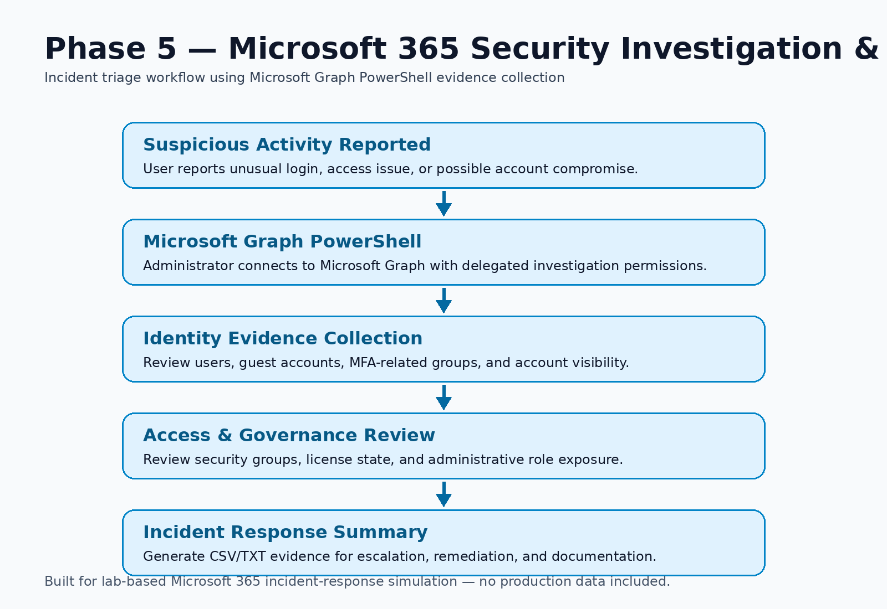

# Phase 8 — Microsoft 365 Initial Security Triage

> **Enterprise-IT-Security-Operations-Toolkit**
> Microsoft 365 security triage workflow using Microsoft Graph PowerShell, Entra ID, licensing, group, and administrative role evidence.

---

## Project Overview

Phase 8 adds an initial evidence-collection layer to the Enterprise IT Security Operations Toolkit.

This phase models what an IT administrator, Microsoft 365 administrator, or security operations analyst may do at the start of a Microsoft 365 security investigation.

The goal is to quickly collect identity, access, licensing, group, and administrative-role evidence before escalation, remediation, or formal incident documentation.

---

## Incident Scenario

A user reports suspicious activity:

> "I think my Microsoft 365 account may have been accessed unexpectedly."

The administrator must quickly answer:

- Who is the affected user?
- What groups or access paths may apply?
- Is the user connected to privileged groups?
- What licenses are active in the tenant?
- What administrative roles exist in the environment?
- What evidence should be collected before escalation?

Instead of manually checking several admin portals, this phase uses Microsoft Graph PowerShell to collect early-stage security triage evidence.

---

## Business Problem

Microsoft 365 incidents often require information from several places:

- Microsoft Entra ID
- Microsoft 365 Admin Center
- Conditional Access
- Microsoft Intune
- Security portal
- Exchange / Teams / SharePoint admin centers

During an incident, slow evidence gathering can delay response and increase risk.

Common issues include:

- Fragmented visibility across portals
- Manual evidence collection
- Inconsistent investigation steps
- Delayed escalation
- Incomplete documentation
- Missed administrative privilege exposure

---

## Implemented Solution

This phase implements an initial Microsoft 365 security-triage workflow using:

- PowerShell 7
- Microsoft Graph PowerShell SDK
- Entra ID user review
- Microsoft 365 license review
- Security group review
- Administrative role review
- CSV/TXT evidence generation
- GitHub documentation and sanitized CSV/TXT reports

The workflow is designed for quick triage, not full forensic investigation.

---

## Architecture



```text
Suspicious Activity Reported
            ↓
Microsoft Graph PowerShell
            ↓
User Enumeration
            ↓
License Governance Review
            ↓
Security Group Review
            ↓
Administrative Role Review
            ↓
Initial Security Triage Evidence Package
```

---

## Repository Structure

```text
phase-8-m365-incident-response-security-triage/
├── README.md
├── scripts/
│   └── invoke-m365-incident-response.ps1
├── reports/
│   ├── Phase8_User_Enumeration_2026-06-01.csv
│   ├── Phase8_License_Governance_2026-06-01.csv
│   ├── Phase8_Security_Group_Review_2026-06-01.csv
│   ├── Phase8_Admin_Role_Review_2026-06-01.csv
│   └── Phase8_Executive_Summary_2026-06-01.txt
└── README.md
```

---

## Investigation Commands Used

```powershell
Get-MgUser -Top 25
Get-MgSubscribedSku
Get-MgGroup -Top 25
Get-MgDirectoryRole
```

These commands validate Microsoft Graph connectivity and collect early-stage triage evidence from the lab tenant.

---

## Evidence Collected

The public evidence package uses sanitized report exports instead of terminal screenshots. This preserves the technical fields and findings while avoiding noisy local paths, account identifiers, and raw tenant values.

### 1. Microsoft Graph User Enumeration

This report demonstrates the user-enumeration output structure used during initial identity review.

[Open sanitized user enumeration report](reports/Phase8_User_Enumeration_2026-06-01.csv)

---

### 2. Microsoft 365 License Governance

This report demonstrates tenant subscription and license-capacity review.

[Open sanitized license governance report](reports/Phase8_License_Governance_2026-06-01.csv)

---

### 3. Entra Security Group Review

This validates visibility into operational and security groups such as:

- MFA-required users
- Security Operations
- IT Operations
- Helpdesk-Level1
- Lab cohort groups
- All Company

[Open sanitized security group review](reports/Phase8_Security_Group_Review_2026-06-01.csv)

---

### 4. Administrative Role Review

This validates visibility into administrative role exposure, including:

- Global Administrator
- Exchange Administrator
- Teams Administrator
- Helpdesk Administrator
- Security Reader
- User Administrator
- SharePoint Administrator

[Open sanitized administrative role review](reports/Phase8_Admin_Role_Review_2026-06-01.csv)

### 5. Triage Summary

[Open sanitized triage summary](reports/Phase8_Executive_Summary_2026-06-01.txt)

---

## Security Operations Value

This phase demonstrates the ability to:

- Use Microsoft Graph PowerShell for security triage
- Review user identity visibility
- Investigate tenant-level licensing state
- Review security and operational groups
- Identify administrative role exposure
- Collect evidence for escalation and incident-response handoff
- Document investigation steps
- Build repeatable investigation workflows

---

## Business Impact

This workflow helps IT and security teams:

- Reduce manual investigation time
- Improve incident documentation
- Standardize first-response procedures
- Improve visibility into identity and access exposure
- Support escalation with clean evidence
- Improve operational consistency during security events

---

## Real-World Relevance

This phase is relevant to environments such as:

- Higher education IT
- Retail IT support
- Microsoft 365 administration
- Managed service providers
- Security operations teams
- Small and mid-sized enterprise IT departments

It mirrors real-world first-response activities performed during account compromise reviews, suspicious activity investigations, and tenant security assessments.

---

## How This Connects to Previous Phases

| Phase | Focus |
|---|---|
| Phase 1 | Enterprise operations foundation |
| Phase 2 | Identity threat and security operations |
| Phase 3 | Endpoint security and Defender operations |
| Phase 4 | BYOD Conditional Access governance |
| Phase 5 | Exchange Online mail flow audit |
| Phase 6 | Web-only access governance |
| Phase 7 | Entra ID app registration audit |
| **Phase 8** | **Microsoft 365 security investigation and incident triage** |

Phase 8 acts as the triage layer that brings identity, access, device, and governance evidence together during an investigation.

---

## Lab Environment Disclaimer

This project was developed using an isolated Microsoft 365 demonstration tenant for self-directed implementation, reporting, and portfolio evidence.

No production tenant data, confidential business information, customer records, or real-world organizational infrastructure is included in this repository.

---

## Future Enhancements

Planned improvements:

- Failed sign-in report
- Risky user report
- Conditional Access impact review
- Secure Score investigation snapshot
- Guest user exposure review
- HTML incident response dashboard
- Incident severity scoring
- Automated executive summary report
- GitHub Actions reporting workflow

---

## Skills Demonstrated

`Microsoft Graph` · `PowerShell` · `Microsoft 365 Administration` · `Entra ID` · `Identity Investigation` · `Security Operations` · `Initial Security Triage` · `Administrative Role Review` · `License Governance` · `Security Documentation`

---

Built by **Md Rahat Islam Anik**
Microsoft 365 Security Operations Portfolio
